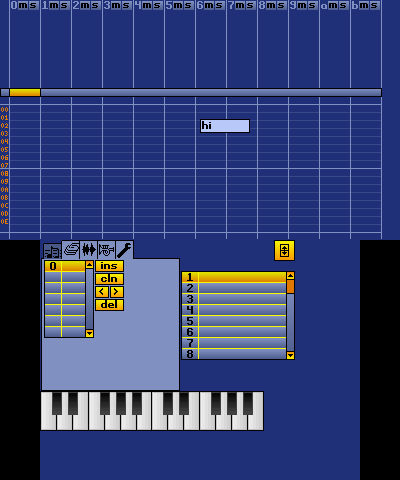

# CitraTracker

CitraTracker aims to be an enhanced port of NitroTracker, by Tobias Weyand, (or more accurately its fork, NitrousTracker) native to the Nintendo 3DS.

it is currently very early-stage and only some of the widgets have been ported

Current progress:

